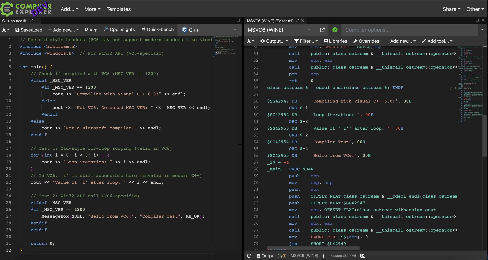

[](https://godbolt.org/)

# Overview

Fork of CompilerExplorer that adds support for Microsoft Visual 6.0 compiler. It is supposed to run using Wine on Linux.

# Screenshoot

[]

# How to run it locally?

0. Get x86 Linux machine
1. Install Wine
2. Using winecfg set windows version to XP
3. Create new wine prefix, e.g wine-vs6
4. Using that prefix install Visual Studio 6.0
5. `git clone git@github.com:domin568/compiler-explorer.git`
6. `cd compiler-explorer && npm install` (initialize dependencies)
7. add new file in `compiler-explorer/etc/config/c++.local.properties` with contents:

```
compilers=msvc6:&gcc:&clang
compiler.msvc6.name=MSVC6 (WINE)
compiler.msvc6.exe=/home/domin568/wine-vs6/drive_c/Program Files (x86)/Microsoft Visual Studio/VC98/Bin/CL.EXE
compiler.msvc6.includeFlag=/I
compiler.msvc6.isSemVer=true
compiler.msvc6.supportsBinary=true
compiler.msvc6.objdumper=
compiler.msvc6.compilerType=wine-vc
compiler.msvc6.demangler=/home/domin568/wine-vs6/drive_c/Program Files (x86)/Microsoft Visual Studio/Common/Tools/UNDNAME.EXE
compiler.msvc6.demanglerType=win32
```

8. copy `compiler-explorer/etc/config/execution.default.properties` to
   `compiler-explorer/etc/config/execution.local.properties` and add line `winePrefix=/home/domin568/wine-vs6` (or other
   prefix that you have choosen before)
9. `npm run dev`
